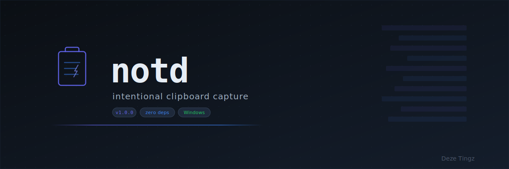

<p align="center">
  
</p>

<p align="center">
  
  
  
  
  
</p>

<p align="center">
  <strong>Fast clipboard capture with automatic content classification.</strong><br>
  <sub>Copy something. Run notd. It is filed and timestamped. That is it.</sub>
</p>

---

## What It Does

notd watches your clipboard and captures content into organized, timestamped log files.
Every capture is automatically classified:

| Type | Detected When | Example |
|------|--------------|---------|
| `url` | Starts with `https://` or `www.` | `https://github.com/Deze-Tingz/notd` |
| `command` | Starts with `git`, `docker`, `npm`, etc. | `git push origin main` |
| `code` | Contains `` ``` ``, `function`, `class`, `def`, `import` | Python function definition |
| `error` | Contains `Exception`, `Traceback`, `FATAL` | Stack trace from terminal |
| `text` | Everything else | Notes, paragraphs, snippets |

---

## Quick Start

### One-Line Install

```powershell
irm https://raw.githubusercontent.com/Deze-Tingz/notd/main/install.ps1 | iex
```

### Manual Install

```powershell
git clone https://github.com/Deze-Tingz/notd.git
python notd/src/notd.py capture
```

Or with PowerShell:

```powershell
.\notd\src\notd.ps1 capture
```

---

## Commands

| Command | Description |
|---------|-------------|
| `notd capture` | Grab clipboard, classify, and save |
| `notd capture --auto-type` | Force type detection even if disabled in config |
| `notd capture --silent` | Capture without sound feedback |
| `notd status` | Show current config and hotkey info |
| `notd open` | Open the captures folder in Explorer |
| `notd config` | Launch the settings UI |
| `notd hotkey` | Start the background hotkey listener |

---

## Configuration

Config lives at `C:\notd\config\notd.config.json` and is auto-created on first run.

See [`config/notd.config.example.json`](config/notd.config.example.json) for the full default.

| Key | Default | Description |
|-----|---------|-------------|
| `root_dir` | `C:\notd_data` | Where captures are stored |
| `text_file_type` | `txt` | Extension for non-code captures |
| `code_file_type` | `md` | Extension for code captures |
| `auto_type` | `true` | Automatically detect content type |
| `sounds_enabled` | `true` | Play Windows system sounds on capture |
| `max_clip_chars` | `200000` | Maximum clipboard characters to capture |
| `hotkey.enabled` | `false` | Enable global keyboard shortcut |
| `hotkey.key` | `N` | Shortcut key (default: Ctrl+Alt+N) |

---

## How It Works

```
Clipboard --> notd --> Type Inference --> File Router --> Timestamped Entry
                |                           |
                |  url? command? code?      |  code --> notd_raw.md
                |  error? text?             |  else --> notd_raw.txt
                |                           |
                +-- Win32 Hotkey (optional)  +-- JSONL mode (if configured)
```

1. **Read** clipboard via tkinter (Python) or PresentationCore (PowerShell)
2. **Classify** content using regex pattern matching
3. **Route** to the appropriate file based on detected type
4. **Append** a formatted, timestamped entry with separator bars
5. **Feedback** with Windows system sounds

---

## Capture Format

Each entry in the capture file:

```
━━━━━━━━━━━━━━━━━━━━━━━━━━
PROJECT: notd
OWNER: Deze Tingz
TIMESTAMP: 2026-02-08 03:27:20
TYPE: url

https://github.com/Deze-Tingz/notd
━━━━━━━━━━━━━━━━━━━━━━━━━━
```

See [`docs/capture-format.md`](docs/capture-format.md) for the full format specification.

---

## Architecture

notd ships as two parallel implementations with identical behavior:

| | Python | PowerShell |
|-|--------|-----------|
| **File** | `src/notd.py` | `src/notd.ps1` |
| **Runtime** | Python 3.10+ stdlib | PowerShell 5.1+ |
| **UI** | tkinter | WinForms |
| **Clipboard** | tkinter | PresentationCore |
| **Hotkey** | ctypes / user32.dll | P/Invoke / Add-Type |
| **Dependencies** | Zero | Zero |

Both implementations share the same config file and output format.

---

## License

MIT &mdash; see [LICENSE](LICENSE).

---

<p align="center">
  <sub>Built by <strong>Val John</strong> at <a href="https://github.com/Deze-Tingz">Deze Tingz</a></sub>
</p>
